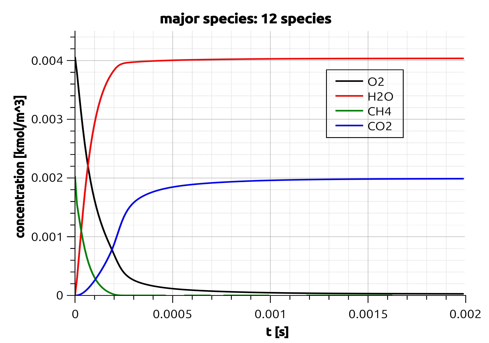
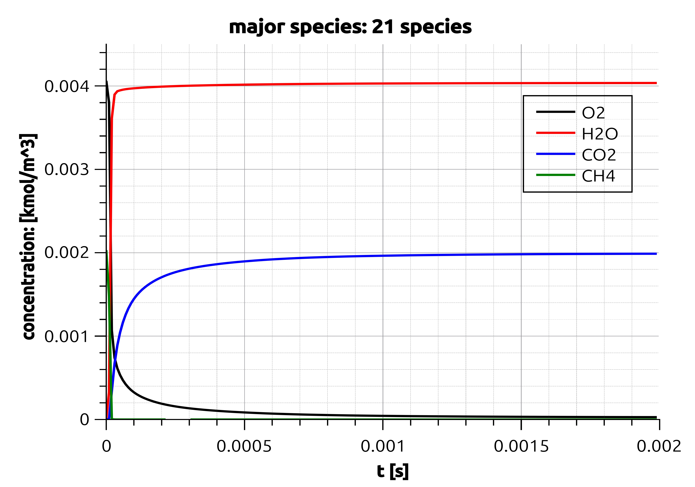
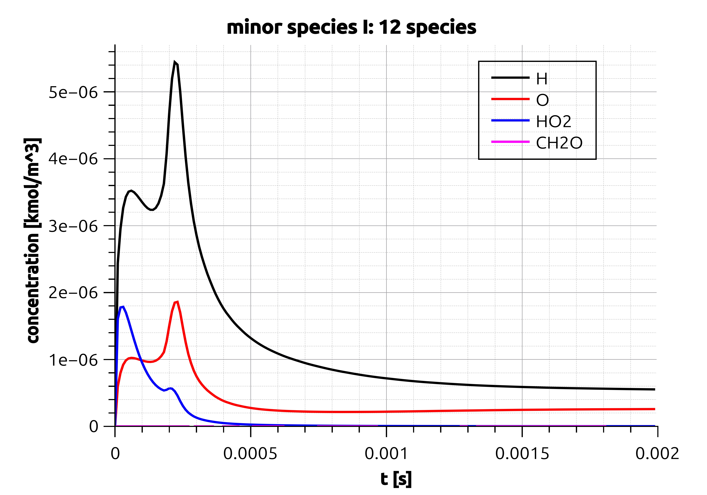
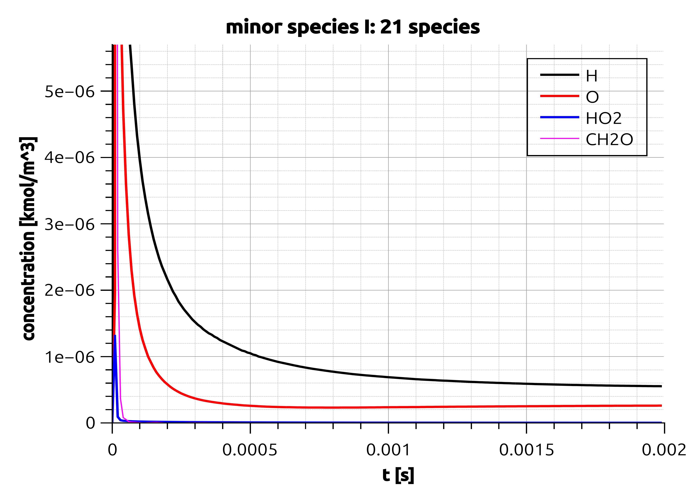
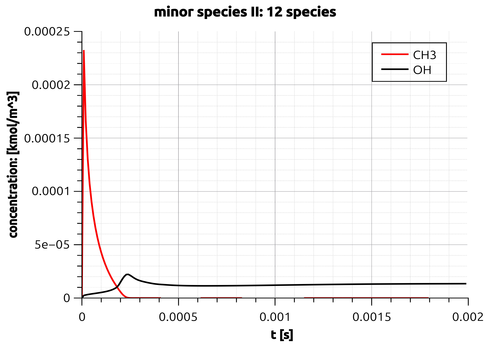
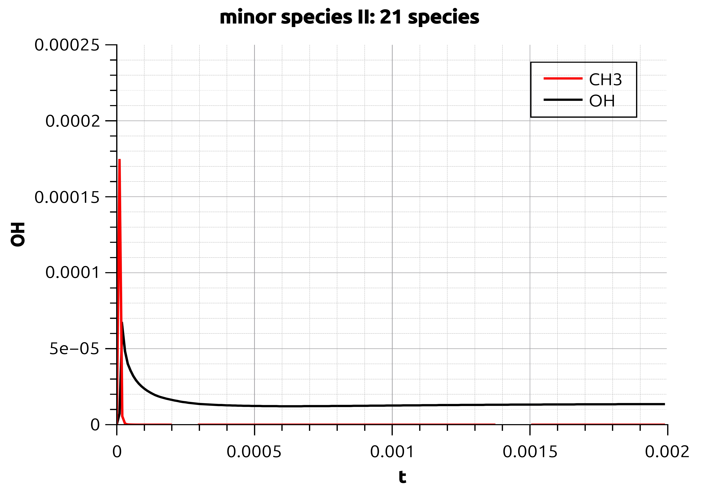

 *This file records the constant T, P reaction of stoichiometric methane oxygen reaction using "FFCM2.yaml" and "FFCMy_12_modified.yaml" as input.*
- T = 2000 K, P = 1 atm, X = CH4:1, O2:2
- The python script ==constant_TP_reaction.py== is an example of how to use ==class constant_TP_reaction== to resolve the constant TP reaction problem given an input file
- Two mechanisms are used for comparison: __"FFCM1_21.yaml"__  and __"FFCMy_12_modified.yaml"__ 

## Reaction using 12 species vs 21 species mechanism

