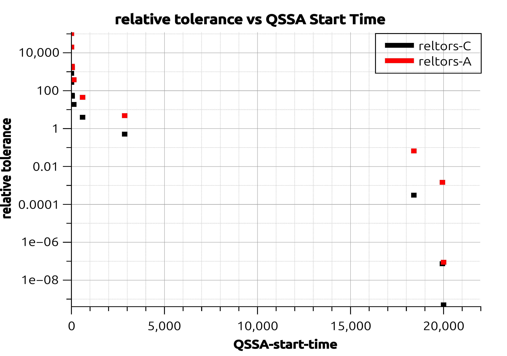
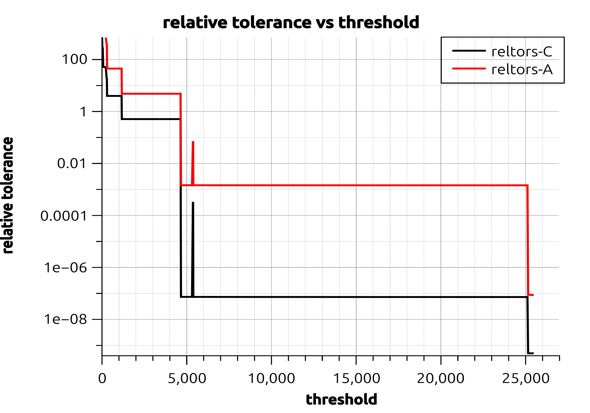
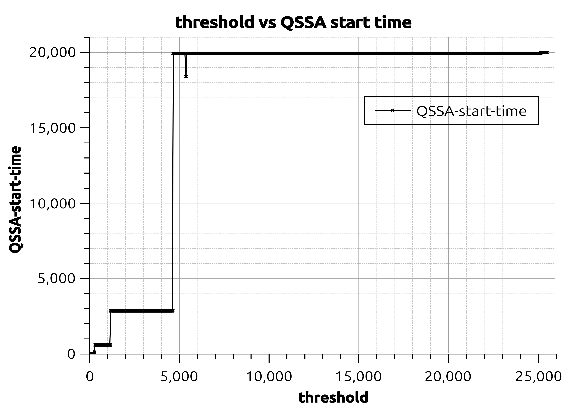

## structure of the directory that keeps ROBER problem##
*use file ROBER_1e4 as an example:*
### Code Scripts ###
-> "BDF_direct.py": This file use direct BDF to solve the ROBER problem
-> "BDF_QSSA.py": Given a threshold, once *species B* reaches threshold, QSSA will apply after the threshold
-> "BDF_QSSA_varying_threshold.py": try to find the threshold interval s.t. the error incurred by the QSSA is lower than 0.1% at the end of the simulation
### Output files ###
-> "thresholds_reltors.csv":  this file contains three columns: threshold, reltors_A, reltors_B.
->-> threshold: $T_{threshold}=[B]/\dot{[B]}$ s.t. above this threshold, B will be considered as Steady State
->-> $\epsilon=\delta/T_s$   
->-> reltor_A and reltor_B: relative tolerance, calculated by $|[B_{QSSA}]-[B]|/[B]$

