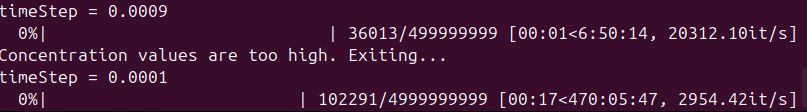

*The time step has to be prohibitively small when I try directly solve the ROBER problem:*

Modification made in attempt to solve the problem:
- change the initial concentration from $[1, 0, 0]$ to $[1, 1e-6, 1e-6]$ 
- To make sure time are not wasted on impossible solutions, I restrained the solution s.t. when any species' concentration exceeds $1e3$, the simulation will be aborted
 Only when time step is 0.0001 s can we prevent the species concentration go off the roof, which takes __470hrs 5min 47s__ to complete the simulation
