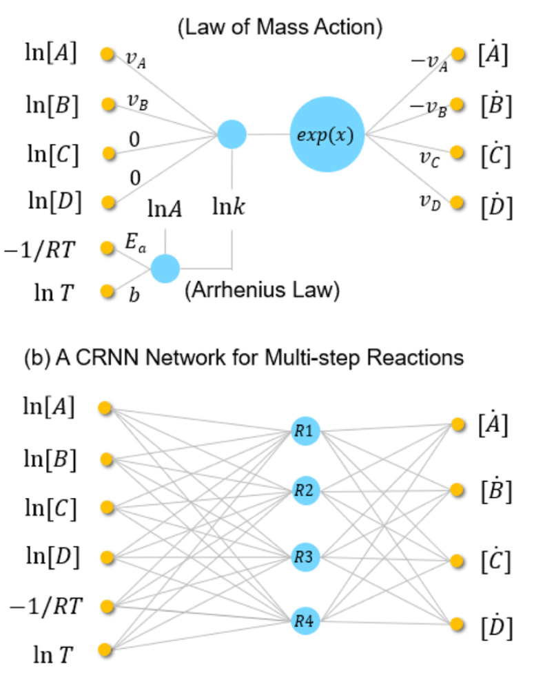

*This paper presents a __Neural Network Approach__ that autonomously discovers __reaction pathways__ from the __time-resolved species concentration data__.*

*Learned model satisfies the physical constraints while maintaining the accuracy in fitting the data.*
## Challenges with Traditional NN vs CRNN ##

| Traditional NN                                                                                                                                                | CRNN                                                                                |
| ------------------------------------------------------------------------------------------------------------------------------------------------------------- | ----------------------------------------------------------------------------------- |
| Symbolic regression and sparse regression can produce physically interpretable kinetic models with known candidate pathways, but only for small simple system | CRNN is a problem-specific structure to learn chemical kinetic models from the data |
| Multiple channel reaction pathways would require duplicated reactions                                                                                         | CRNN can identify system without any prior knowledge of the chemical system         |
| Capable to approximate unknown reaction pathways, but the weights are difficult to interpret physically                                                       | CRNN embeds the physics in itself                                                   |
## Physics and Structure of the CRNN##
for true elementary reaction: $\nu_A A + \nu_B B → \nu_c C + \nu_D D$ 
the reaction rate is: $r = exp(ln(K) + \nu_A ln[A] + \nu_B ln[B] + 0 ln[C] + 0 ln[D])$
for every species: $\dot{S_i} = \nu_{S_i} \cdot r \cdot [S_i]$
for rate constant: $k = AT^b exp(-\frac{E_a}{RT})$

Combining all above to form a __Physics Embedded NN__:

$CRNN(Y) = \dot{(Y)}$

### Question: Where to embed the FCNN?###

### How to determine the FCNN?###
- Using ==grid searching approach== to determine the number of hidden nodes
- employ hard threshold pruning to encourag=e sparsity in the learning CRNN weights, especially the ==reaction orders== and ==stoichiometric coefficients==

## Strengths and Weakness of the CRNN approach ##
__Strength__:
- Learned stoichiometric coefficients and reaction orders are very close to integers
- CRNN can be trained with incomplete __species concentration time history datasets__ and the species profiles of unmeasured species can be inferred
- Capable to deal with catalytic reaction in which some species are present in both reactants and products

__Weakness__:
- Difficult to deal with training that lacks some species