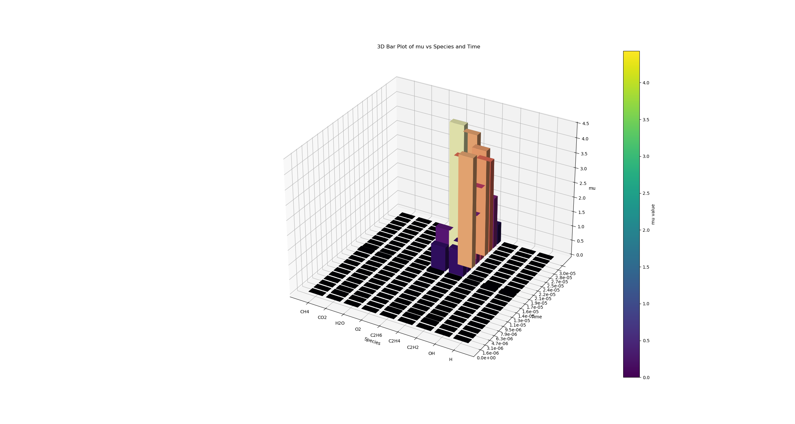
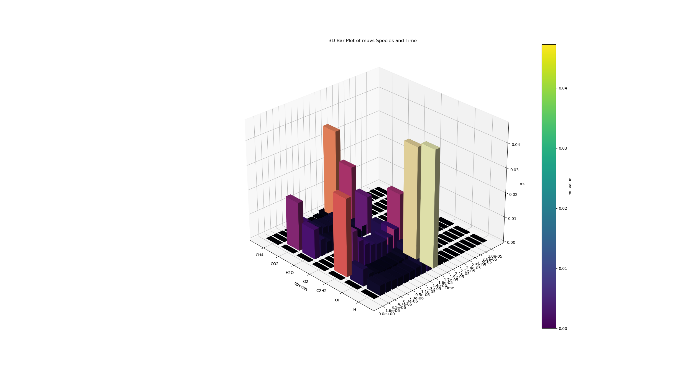

All files under this directory are made in attempt to:
    (i) Use constant volume reactor for stoichiometric $CH_4$ and $O_2$ at P = 1 atm and T = 2000 K as an example case
    (ii) find out the net_production_rates at each time step for each species
    (iii) for each time step, rank $\frac{\frac{d[S_i]}{dt}\cdot \delta t}{[S_i]}$ 

## "mu_ranking.py"
- In this script, I chose two sets of species, and plot there dimensionless net production rate ($\mu$.) The x axis is species name, the y axis is time, and the z axis is $\mu$.

__Set 1:__ {"CH4", "CO2", "H2O", "O2", "C2H6", "C2H4", "C2H2", "OH", "H"}

__Set 2:__ {"CH4", "CO2", "H2O", "O2", "C2H2", "OH", "H"}

Problem(s): 
1. Numerical problem, especially for species that will eventually depleted:
Concentration of $C_2H_4$ & $C_2H_6$ eventually goes to 1e19 level.
