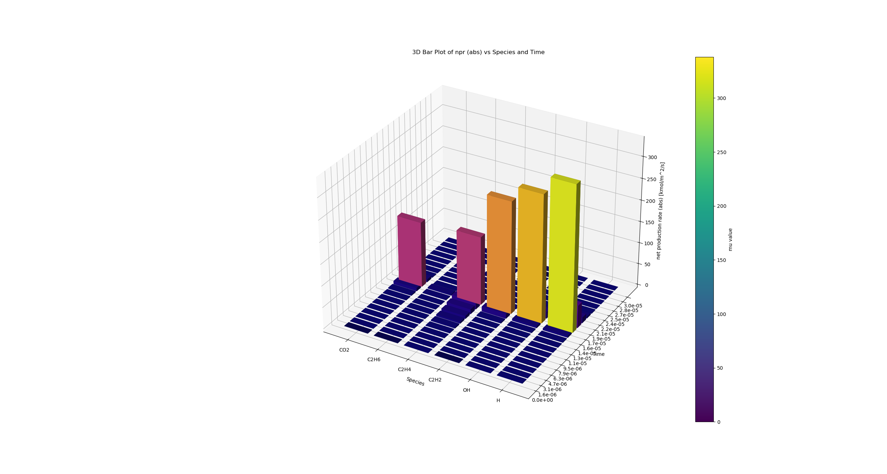
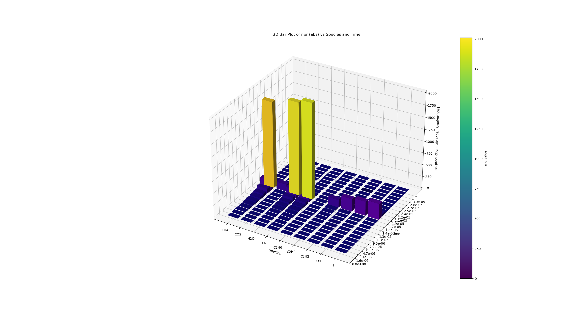

All files under this directory are made in attempt to:
    (i) Use constant volume reactor for stoichiometric $CH_4$ and $O_2$ at P = 1 atm and T = 2000 K as an example case
    (ii) find out the net_production_rates at each time step for each species
    (iii) for each time step, rank $\frac{\frac{d[S_i]}{dt}\cdot \delta t}{[S_i]}$ 

## "mu_ranking.py"
*In this script, I chose two sets of species, and plot there dimensionless net production rate ($\mu$.) The x axis is species name, the y axis is time, and the z axis is $\mu$.*

__Set 1:__ {"CH4", "CO2", "H2O", "O2", "C2H6", "C2H4", "C2H2", "OH", "H"}

__Set 2:__ {"CO2", "C2H6", "C2H4", "C2H2", "OH", "H"}

Challenge(s):
How to make a __global criteria(e) "$\epsilon$"__ for all species?
# "npr_ranking.py"
[Net Production Rate](cantera_example/npr_ranking/plots/npr_summary.pdf)
[D-less NPR](cantera_example/npr_ranking/plots/mu_summary.pdf)

## Observations:
1. 

# mu_indi_species.py
*This function plots the time varying of $\mu$ of each individual species.*

